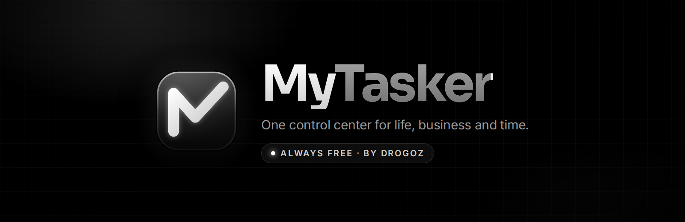
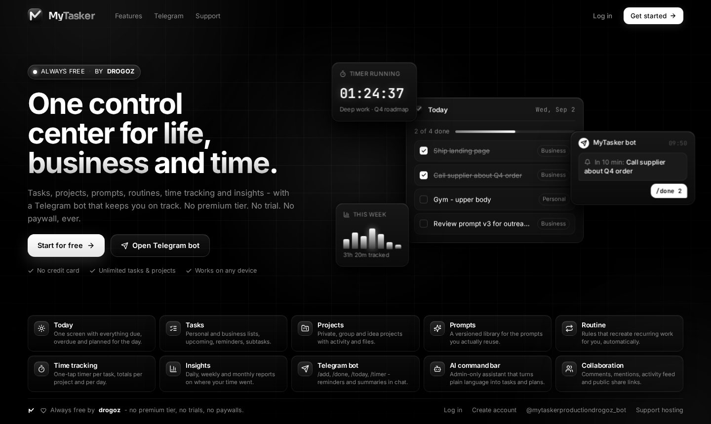
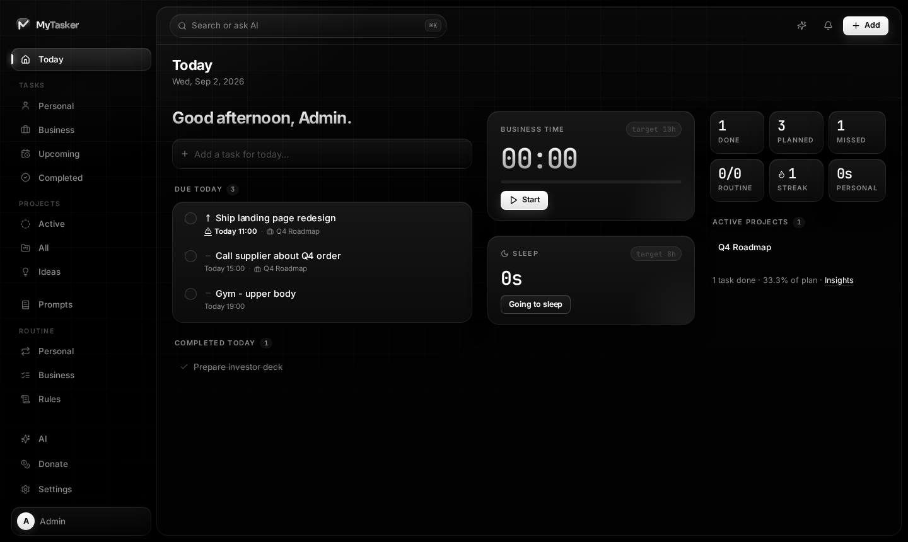
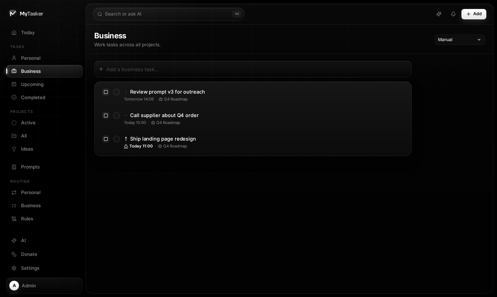
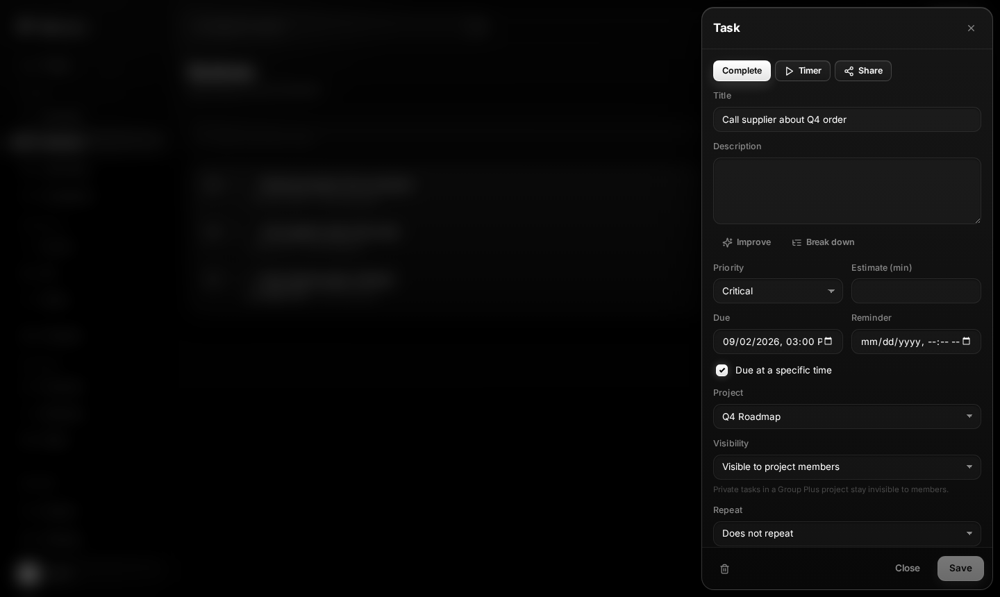
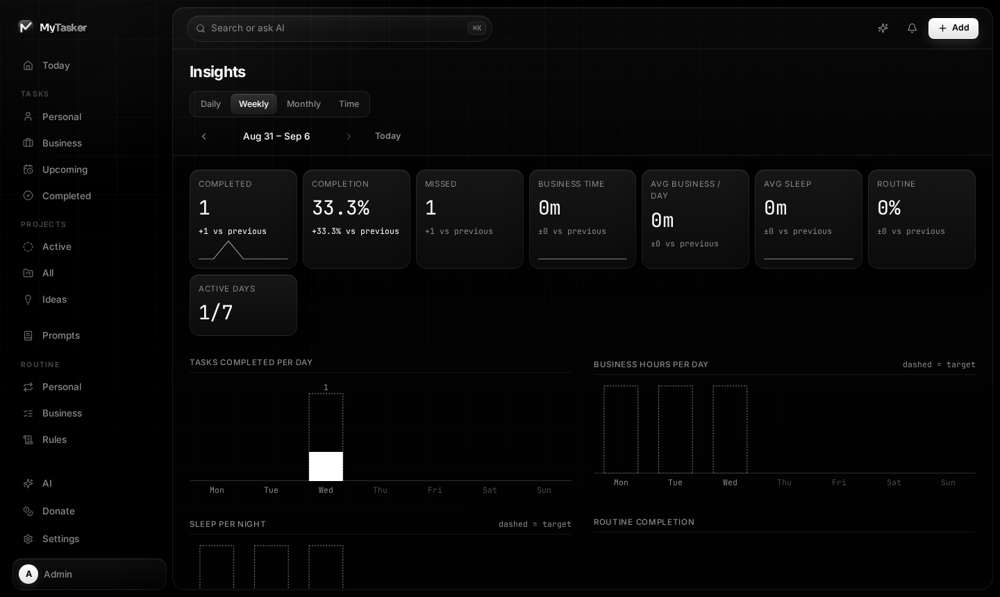
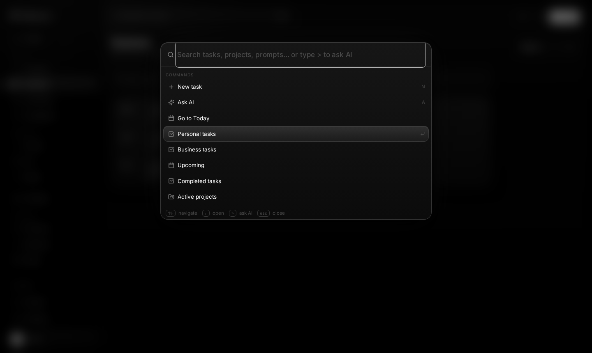
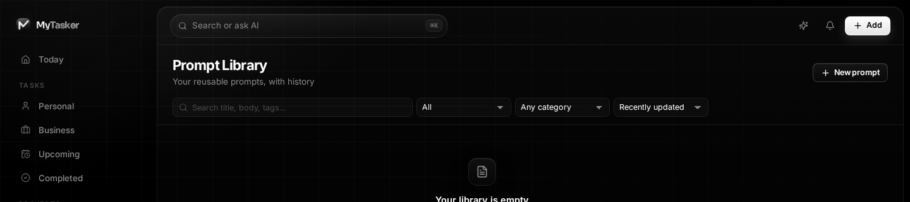
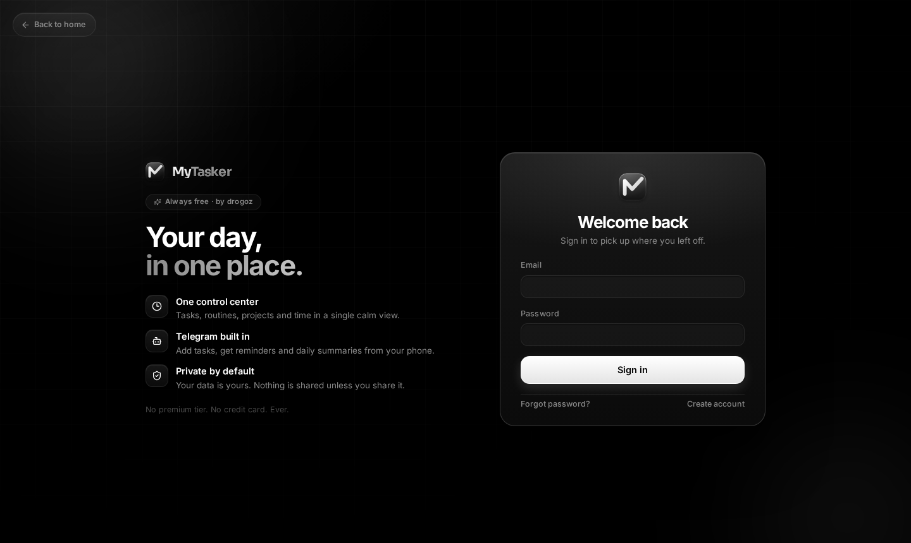
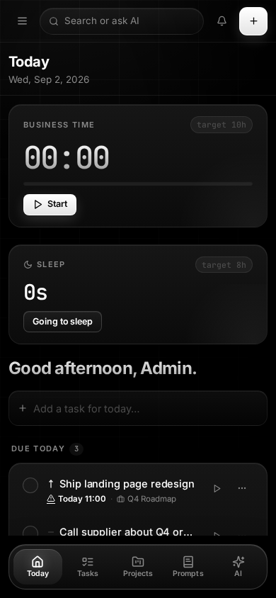

<p align="center">
  
</p>

<p align="center">
  <a href="https://mytasker.io"></a>
  
  
  
  
  
  <a href="https://t.me/drogoz"></a>
</p>

<p align="center">
  <b>MyTasker</b> is a calm, monochrome control center for everything you have to do:<br>
  tasks, projects, prompts, routines, time tracking, insights, a team layer and a Telegram bot.<br>
  No premium tier. No trial. No paywall. Ever. Built by <b>drogoz</b>.
</p>

<p align="center">
  <a href="#-features">Features</a> ·
  <a href="#-screenshots">Screenshots</a> ·
  <a href="#-telegram-bot">Telegram bot</a> ·
  <a href="#-architecture">Architecture</a> ·
  <a href="#-getting-started">Getting started</a> ·
  <a href="#-deployment">Deployment</a> ·
  <a href="#-security--privacy">Security</a> ·
  <a href="#-author--support">Author & support</a>
</p>

---

<p align="center">
  
</p>

## ✦ Why MyTasker

Most task apps are either a toy or a subscription. MyTasker is neither.

- **One screen for the whole day.** Overdue, due today, focus items, routines, business hours, sleep and active projects - on a single page that fits without scrolling.
- **Life and business kept apart, but together.** Every task, routine and timer is either _personal_ or _business_. Insights compare the two.
- **Time is a first-class citizen.** One-tap timers per task, daily business-hour targets, sleep tracking, weekly and monthly reviews.
- **Your phone is the remote.** A Telegram bot adds tasks, completes them, runs timers, sends reminders and evening/weekly summaries.
- **Private by default.** Everything is owner-scoped; sharing is explicit, per project, with `private` / `group` / `group_plus` modes.
- **Monochrome, volumetric UI.** Black, white and light - no hue is ever used for meaning. Depth comes from gradients, rims and glow.

## ✦ Features

| | Module | What it does |
|---|---|---|
| ☀️ | **Today** | Greeting, quick-add composer, overdue / due today / focus, completed with undo, business & sleep timers, routines, six live metrics, active projects. |
| ☑️ | **Tasks** | Personal & business lists, upcoming, completed, subtasks, priorities (critical → low), due dates with optional time, reminders, estimates, recurrence, bulk actions, drag ordering. |
| 📁 | **Projects** | Active / all / ideas boards, per-project time totals, members & roles, comments, activity feed, attachments, public share links. |
| 📝 | **Prompts** | A versioned library for the prompts you keep re-typing: categories, tags, favorites, history & diff, share with a project, one-click copy. |
| 🔁 | **Routine** | Personal and business daily routines with start times and targets, "current item" highlighting, streaks, and **Rules** - principles you decide to live by. |
| ⏱️ | **Time tracking** | Start/stop timers on tasks, routine items or free notes; daily business-hour target; sleep start/wake; per-project totals. |
| 📊 | **Insights** | Daily, weekly, monthly and time reports: completion rate, missed, business hours vs target, sleep vs target, routine completion, active days, sparkline deltas vs the previous period. |
| 🤖 | **Telegram bot** | `/today`, `/add`, `/done`, `/list`, `/timer`, `/summary`, `/week`, inline buttons, reminders and scheduled summaries - all scoped to the linked account only. |
| ✨ | **AI command bar** | Admin-only assistant (Anthropic Claude) that turns plain language into tasks and plans, improves task text, breaks tasks down, and can be confirmed/cancelled inline in Telegram. |
| 👥 | **Collaboration** | Project members, mentions, comments, per-item visibility, real-time updates over WebSockets, notification center with unread badge. |
| 🔗 | **Sharing** | Public read-only share pages for tasks and projects with revocable links. |
| ⌨️ | **Command palette** | `⌘K` search across tasks, projects, prompts and commands; `>` prefix asks the AI (admins). Global shortcuts for everything. |
| 📱 | **PWA** | Installable, offline shell, floating mobile dock, safe-area aware. |

## ✦ Screenshots

<table>
  <tr>
    <td width="50%">
      
      <p align="center"><sub><b>Today</b> - the whole day on one screen</sub></p>
    </td>
    <td width="50%">
      
      <p align="center"><sub><b>Tasks</b> - business list with composer and bulk select</sub></p>
    </td>
  </tr>
  <tr>
    <td width="50%">
      
      <p align="center"><sub><b>Task editor</b> - floating drawer with AI tools, timer and share</sub></p>
    </td>
    <td width="50%">
      
      <p align="center"><sub><b>Insights</b> - weekly report with deltas vs previous period</sub></p>
    </td>
  </tr>
  <tr>
    <td width="50%">
      
      <p align="center"><sub><b>Command palette</b> - ⌘K for everything</sub></p>
    </td>
    <td width="50%">
      
      <p align="center"><sub><b>Prompt library</b> - search, filter, versions</sub></p>
    </td>
  </tr>
  <tr>
    <td width="50%">
      
      <p align="center"><sub><b>Sign in</b> - brand story + glass form</sub></p>
    </td>
    <td width="50%" align="center">
      
      <p align="center"><sub><b>Mobile</b> - floating dock, timers first</sub></p>
    </td>
  </tr>
</table>

## ✦ Telegram bot

<p align="center"></p>

Link once from **Settings → Telegram → Connect**. The app generates a one-time deep link (`https://t.me/<bot>?start=<token>`); the token is hashed at rest, expires, and burns on first use. After that your phone is a remote control:

| Command | Effect |
|---|---|
| `/today` | Today's plan: overdue, due, focus, routine progress, business hours |
| `/add Call Nino tomorrow 15:00 !high #business` | Natural quick-add with date/time, priority and kind parsing |
| `/done <id or text>` | Complete a task (fuzzy match on title) |
| `/list [filter]` | Open tasks, optionally filtered |
| `/timer [task]` | Start / stop the business timer |
| `/summary` | Evening review of the day |
| `/week` | Weekly review |
| _plain text_ | Quick-add for everyone; admins get the AI planner with inline **Confirm / Cancel** |

Scheduled by Celery beat, per user timezone: morning plan, due-soon reminders, evening summary, weekly review.

**Isolation guarantees**

- A chat can be linked to exactly one account; linking a chat elsewhere unlinks it first.
- Unlinked chats get a single "not linked" hint and nothing else.
- Every query goes through `Task.objects.visible_to(user)` - you only ever see your own tasks and the shared items of projects you are a member of.
- Groups and channels are refused outright; the bot is 1:1 only.
- Once a chat is linked, only the Telegram user who linked it can issue commands in it.
- Outbound delivery is idempotent, retried with backoff, and a blocked bot deactivates the connection.
- Bot tokens and API keys are redacted from all logs, including Celery workers.

## ✦ Architecture

```
Browser (SolidJS SPA, PWA)  ──HTTPS──┐
Telegram Bot API  ──webhook──────────┐│
                                     ▼▼
                     nginx  (TLS · static SPA · /api + /ws proxy · CSP)
                                     │
                    uvicorn  (Django 5.1 ASGI · DRF · Channels)
                     │              │                │
              PostgreSQL 16       Redis         Celery worker + beat
              (source of truth)   (cache · broker ·   (notifications · telegram ·
                                   channels · locks)   analytics · reminders ·
                                                       recurrence · cleanup)
```

**Backend** - Django 5.1 + Django REST Framework, Channels for WebSockets, Celery for background work, `django-environ` for configuration. Each domain lives in `backend/apps/<name>/` with thin views and fat `services.py`; every model exposes a `visible_to(user)` manager so authorization is impossible to forget.

```
backend/apps/
  accounts      auth, sessions, email verification, /me, public config
  tasks         tasks, subtasks, recurrence, ordering, bulk ops
  projects      projects, modes (private / group / group_plus), members, ideas
  prompts       versioned prompt library
  routines      routine items, rules, completion, streaks
  time_tracking timers, sleep, daily targets
  analytics     daily / weekly / monthly / time reports
  collab        comments, mentions, activity feed
  sharing       public share links
  notifications in-app + push notification center
  realtime      Channels consumers, live invalidation
  telegram      linking, webhook, commands, deliveries, schedules
  ai            Anthropic provider, tools, plans, admin-only permission
  donations     "buy the author a coffee" without ever gating features
  audit         immutable audit log
```

**Frontend** - SolidJS + Vite 6, TypeScript strict, CSS Modules on top of a single token sheet (`src/styles/tokens.css`). No UI framework; every component is ~100 lines and owns its CSS. Fonts (Inter, Sora, JetBrains Mono) are self-hosted so the CSP stays `'self'`.

```
frontend/src/
  app/        routes, protected layout, providers
  layouts/    AppShell (dock + floating canvas), Sidebar, TopBar, MobileNav, AuthLayout
  components/ ui (Button, Input, Modal, Drawer, Dropdown, Feedback) · shared (Page, Logo, Indicators)
  features/   tasks, projects, prompts, routines, timer, insights, ai, collab, command, notifications, sharing
  routes/     Landing, Today, AI, Donate, auth/*, projects/*, prompts/*, routine/*, insights/*, settings/*, share/*
  stores/     auth, ui, timer, notifications (Solid signals)
  api/        typed fetch client with CSRF, retries and error mapping
```

The full design document lives in [`docs/ARCHITECTURE.md`](docs/ARCHITECTURE.md).

## ✦ Design system

A deliberately monochrome, volumetric language shared by the landing page and the app:

- **Colour never carries meaning.** Priority is weight and stroke; danger is a dashed rim that inverts on hover; success is a filled white check.
- **Depth instead of hue.** Gradient surfaces (`--g-surface`), glass layers (`--g-glass*`), a 1px top light rim (`--rim-top`), layered neutral shadows and white glow (`--glow`).
- **Dock + canvas.** A transparent sidebar dock and the app rendered on a floating, rounded panel. On mobile the navigation becomes a floating blurred dock.
- **Type.** Inter for UI, Sora for the wordmark, JetBrains Mono for numbers and time.
- **Tokens.** Everything - radii, spacing, type scale, motion, elevation - is a CSS custom property in one file, so a redesign is a diff of a few hundred lines.

## ✦ Getting started

### Prerequisites

- Python 3.12+, Node 20+
- PostgreSQL 16, Redis 7

### Backend

```bash
cd backend
python -m venv .venv && source .venv/bin/activate
pip install -r requirements.txt -r requirements-dev.txt
cp .env.example .env            # fill in DATABASE_URL, REDIS_URL, secrets
python manage.py migrate
python manage.py createsuperuser  # superusers/staff get the AI assistant
uvicorn config.asgi:application --reload --port 8015
```

Background workers (separate terminals):

```bash
celery -A config worker -l info
celery -A config beat -l info
```

### Frontend

```bash
cd frontend
npm install
npm run dev                     # http://localhost:5173, proxies /api and /ws to :8015
```

### Tests & quality

```bash
# backend
cd backend && pytest -q && ruff check . && ruff format --check .
# frontend
cd frontend && npm run typecheck && npm test && npm run build
```

### Telegram (optional)

1. Create a bot with [@BotFather](https://t.me/BotFather), put the token in `TELEGRAM_BOT_TOKEN` and the handle in `TELEGRAM_BOT_USERNAME`.
2. Set a random `TELEGRAM_WEBHOOK_SECRET`.
3. Register the webhook once: `python manage.py telegram_webhook` (`--info` / `--delete` to inspect or remove).
4. In the app open **Settings → Telegram → Connect** and tap the deep link.

### AI (optional, admins only)

Set `ANTHROPIC_API_KEY` and `ANTHROPIC_MODEL`. Only accounts with `is_staff` can reach any AI endpoint, panel, shortcut or Telegram planner; everyone else keeps the classic quick-add. The frontend learns about it from `/api/v1/auth/me/` (`ai_enabled`) and `/api/v1/auth/config/` (`ai_admins_only`).

## ✦ Deployment

`backend/deploy/` contains everything used for [mytasker.io](https://mytasker.io):

- `systemd/` - `mytasker-web` (uvicorn), `mytasker-worker` (Celery), `mytasker-beat`
- `nginx/` - TLS vhost, static SPA, `/api` + `/ws` proxy, strict CSP and security headers
- `deploy.sh` - pull, install, migrate, build, collectstatic, restart

```bash
cd backend/deploy && ./deploy.sh
```

Production settings live in `config/settings/prod.py`; `.env` is read by `django-environ`, never sourced by a shell.

## ✦ Security & privacy

- Session auth with CSRF, rate limiting on auth and webhook endpoints, `frame-ancestors 'none'`, strict CSP, HSTS.
- Every queryset is owner- or membership-scoped via `visible_to(user)`; `group_plus` lets an owner keep private items invisible to members.
- Secrets are redacted from logs by `common/logging.py` (bot tokens, Anthropic keys), and the filter is re-applied inside Celery workers.
- Telegram link tokens are hashed; chats are 1:1 only; sender identity is verified.
- Public share links are unguessable and revocable.
- No analytics, no trackers, no third-party fonts or scripts.

## ✦ Author & support

<table>
  <tr>
    <td width="50%" valign="top">
      <h3>👤 Author</h3>
      <p>MyTasker is designed, built and hosted by <b>drogoz</b> - a one-person project, kept free forever.</p>
      <p>Questions, ideas, bugs, or just want to say hi?</p>
      <p><a href="https://t.me/drogoz"></a></p>
      <p><sub>Also live on the site: <a href="https://mytasker.io/support">mytasker.io/support</a></sub></p>
    </td>
    <td width="50%" valign="top">
      <h3>₿ Support hosting</h3>
      <p>Donations are optional and never unlock anything - there is nothing to unlock. If MyTasker saves you time, you can chip in for servers and coffee.</p>
      <p><b>Bitcoin</b> (Bitcoin network, native SegWit):</p>
      <pre><code>bc1qts0wedujmzrthge9fqpc29ufezpyq87hz3wwe7</code></pre>
      <p><sub>Send only BTC on the Bitcoin network to this address.</sub></p>
    </td>
  </tr>
</table>

## ✦ Roadmap

- [ ] Natural-language recurrence ("every 2nd Tuesday")
- [ ] Calendar view and ICS feed
- [ ] Offline-first task queue in the PWA
- [ ] More bot channels (WhatsApp / Signal) behind the same command layer
- [ ] Self-host one-liner (`docker compose up`)

## ✦ Contributing

Issues and pull requests are welcome. Keep the rules of the house:

1. Business logic goes in `services.py`, not views.
2. Every new model gets `visible_to(user)` and a test proving strangers see nothing.
3. No colour for meaning. Ever.
4. `pytest`, `ruff`, `tsc` and `vitest` must be green.

---

<p align="center">
  <br>
  <sub>Always free · by <a href="https://t.me/drogoz"><b>drogoz</b></a> · <a href="https://mytasker.io">mytasker.io</a> · bot <a href="https://t.me/mytaskerproductiondrogoz_bot">@mytaskerproductiondrogoz_bot</a> · <a href="https://github.com/deepdrogo/mytasker">GitHub</a></sub>
</p>
